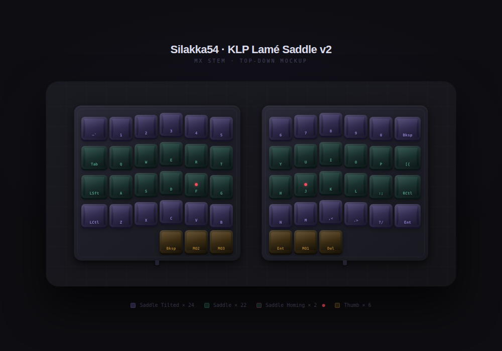

# Silakka54 Trainer

A terminal-based typing trainer for the [Silakka54](https://github.com/Squalius-cephalus/silakka54) split ergonomic keyboard — built with Python curses.



## Modes

| Key | Mode | Description |
|-----|------|-------------|
| `1` | Base L0 | QWERTY typing — get comfortable with the split & column stagger |
| `2` | Nav L1 | Practice text with nav-layer hints (MO1 + hjkl / y/n / u/o) |
| `3` | Sym L2 | Code snippets heavy on symbols from the symbol layer |
| `4` | Mixed | Everything at once |
| `5` | **KeyFlash** | Flashcard mode — type a displayed key from any layer |

### KeyFlash mode

The trainer flashes a target key (symbol, arrow, function key) and you must produce it using the correct layer combo. Your keyboard firmware handles the layer switching — the terminal just sees the resulting keycode.

- **First-try correct** counts toward your accuracy score
- **Wrong press** → hint auto-reveals, must still type the correct key to advance
- `h` — reveal hint early (no accuracy penalty)
- `f` — cycle layer filter: All → L1 Nav → L2 Sym → L3 Fn

**Key pool:**
- L1 (8 keys): ← ↓ ↑ → PgUp PgDn Home End
- L2 (15 keys): `( ) { } [ ] + = - _ ' \` ~ | \`
- L3 (12 keys): F1–F12

> **Note:** Some terminals intercept F1/F11/F12 before the app sees them. This is a terminal setting — try a different terminal or remap if needed.

## Controls

| Key | Action |
|-----|--------|
| `Tab` | Cycle to next mode |
| `r` | Restart / reset current mode |
| `q` / `Esc` | Quit |

## Usage

```bash
python3 silakka54_trainer.py
```

Requires Python 3 with `curses` (included in stdlib on Linux/macOS).

## Keymap reference

See [keymap.pdf](keymap.pdf) for the full Silakka54 layer reference.

> The L3 function key hints in the trainer are based on the v4 keymap. If your layout differs, update the `KEY_CHALLENGES` list in the script.
